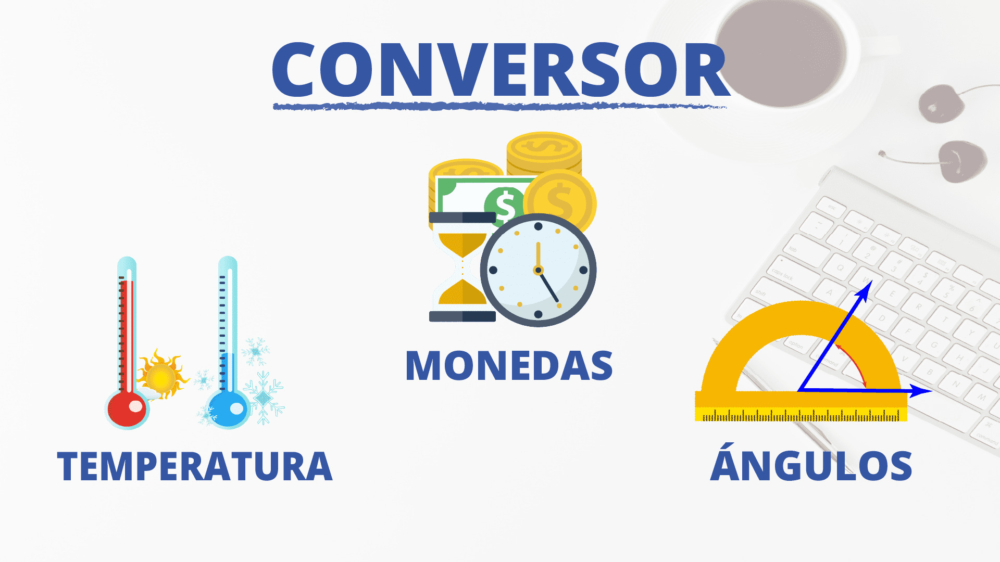
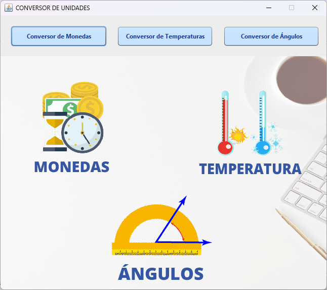
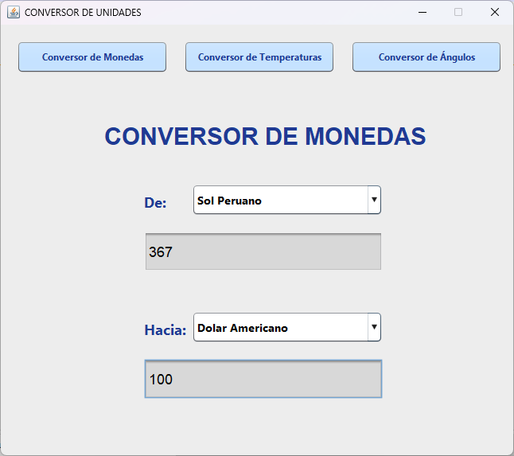
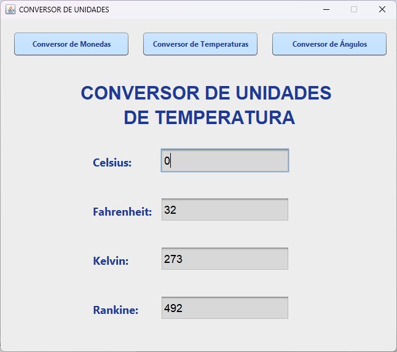
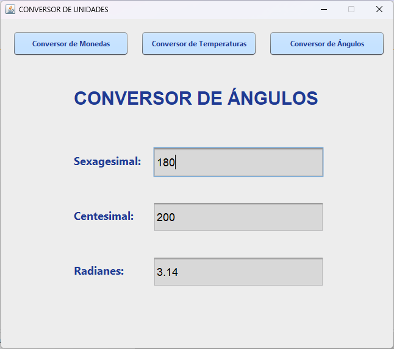

<h1 align="center"> CONVERSOR DE UNIDADES</h1>

 
 
 

 ## Introducción
 El propósito fundamental de este proyecto es aplicar de manera práctica los conocimientos adquiridos en el ámbito del lenguaje de programación Java y la Programación Orientada a Objetos. Como resultado de estos esfuerzos, hemos desarrollado una aplicación de escritorio que ofrece al usuario la capacidad de efectuar conversiones entre diversas monedas internacionales. Además, esta herramienta permite explorar las equivalencias entre unidades de temperatura y ángulos geométricos en los distintos sistemas de medida existentes en el mundo.

 ## Índice
   * [Introducción](#introdución)
   * [Índice](#indice)
   * [Descripción del proyecto](#descripción-del-proyecto)
   * [Estado del Proyecto](#estado-del-proyecto)
   * [Funcionalidades del proyecto](#hammer-funcionalidades-del-proyecto)
   * [Tecnologías utilizadas](#tecnologías-utilizadas)
   * [Autor](#autor)

 ## Descripción del proyecto
El presente proyecto en desarrollo, facilita la conversión de unidades de medida, tales como monedas, temperaturas y ángulos; utiliza los datos actualizados de los tipos de cambio y las fórmulas correspondientes para realizar las conversiones de forma precisa y rápida.
El usuario puede ingresar los valores que desea convertir y seleccionar las unidades de origen y destino, y la aplicación le mostrará el resultado en la pantalla.

   
  

 ## Estado del Proyecto
 
   :construction: Proyecto en su primera versión (v1.0) :construction: 

 ## Funcionalidades del Proyecto

  
Para llevar a cabo cualquier conversión, el usuario debe elegir previamente el tipo de conversión deseada. Luego deberá hacer clic en el botón correspondiente al tipo de conversión que se desea ejecutar. La aplicacion cuenta con tres sistemas de conversiones que se detallan a continuación.

  <h4>Conversor de Monedas</h4> 
    
En su versión 1.0, la aplicación le permite realizar el cambio de divisas entre el Dólar, Euro y Sol (peruano).

    
El usuario debe seleccionar la divisa de origen y destino, luego ingresar el monto en la caja de texto y la aplicación realizará el cambio en tiempo real.

    
 
     
    

  <h4>Conversor de unidades de Temperatura`</h4>
    
Facilita la búsqueda de equivalentes de temperatura entre los cuatro sistemas de medida principales: Celsius, Fahrenheit, Kelvin y Rankine.
 
    
El usuario deberá elijir la casilla de entrada correspondiente al sistema de medida desde el cual desea realizar la conversión. Tras esto, introduce la cantidad a convertir. La aplicación exhibirá de manera inmediata las equivalencias en los otros sistemas

    
 
     
    

    
  <h4>Conversor de unidades de medida de Ángulos</h4>
    
Facilita la determinación de equivalencias entre diversas unidades de medida de ángulos, incluyendo sistemas como Sexagesimales, Centesimales y Radianes.

    
Los usuarios simplemente seleccionan el sistema de medida de partida y proporcionan el valor correspondiente. La aplicación instantáneamente calcula y muestra las equivalencias en los otros sistemas mencionados. 

    
 
     
    

 ## Tecnologías utilizadas
 - JDK 20
 - Maven

 ## Autor
[ Cristian Rojas](https://github.com/cbrojas)
